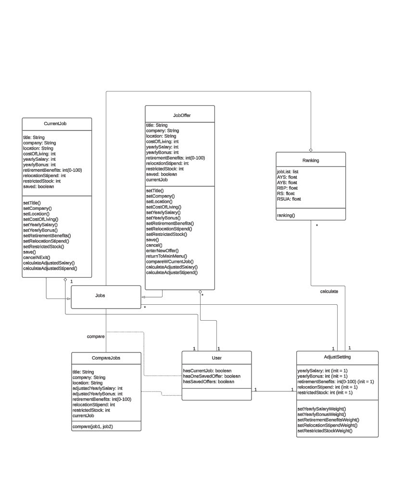

### Group Project, Deliverable 1 
#### 6300 Spring22 - Team082

##### Design 1 (rli445) 

- __Pros__:  
	- Separation of concerns - Clear distinction of current job detail and new job offer(s) using 2 separate classes.
	- Naming conventions - All the attributes and operations are following a convention which are making them easier to read.
	For example - setCostOfLiving(), setYearlyBonus(), calculateAdjustedSalary(), etc.
	- User class has made good use of attributes like hasCurrentJob, hasSavedOffers which is very useful in implementing requirements of - compare job offers. This feature can be enabled specifically when these attributes are set to true.
- __Cons__: 
	- User class features can be simplified. For example, currently there are 2 attributes in this class to identify the existence of job offer(s), making it difficult to manage. 
	- Duplication of attributes and operations in the class CurrentJob and Job Offer.
	Both these classes can take advantage of the common parent class and move all these common attributes and operations to this parent class. This will simplify management of these attributes and operations whenever any modification has to be done.
	- There are many operations which need to explicitly specify their return values. This will ease in making use of these operations from the view or other classes.
	- The design is not showing private/public notations on operations/attributes.
-----------------------------------------------------------------------------------------------------------------	

##### Design 2 (hrashid6)

- __Pros__:
	- Requirement of ranking various job offers is implemented very well using class Comparion_Set and operation- rank().
	-  Good decoupled design - Job Ranking parameters are grouped in a class called - weight_algo, job specific ranking information is placed in a class - ranking and there is a separate class for job comparison. 
	- In this design, there is a class called - JOB_MANAGER which serves as a bridge between User(Actor) and the operation being performed on the job class. This JOB_MANAGER  class isolates all the actions\operations of the job class within it, making the Job class very light and easier to understand.
- __Cons__:
	- Inaccurate use of class relationship notation like Is-A relationship arrows are pointing in opposite directions.
	- The design is not showing private/public notations on operations/attributes.
	- Method signatures are not clearly defined. For example, add_current_job takes in an optional job_id when it should not take any parameter. 
	- The design can be simplified a bit more. For example, class - job_current doesn't have to exist as a separate class, it can me converted as an attribute on job since it has no additional operations
-----------------------------------------------------------------------------------------------------------------

##### Design 3 (mshetty7)

- __Pros__:
	- Notation conventions - Clear use of private/public/derived attribute/operation notations on all classes
	- Clearly organized, easy to follow flow of UI view, making this design very simple to understand.
	- Very descriptive textual information is used when describing relationships between the classes. This makes design very clear and easy to follow in this case.
- __Cons__:
	- The design can be simplified. Unnecessary use of classes like - state and city in this case.
	- The class - JobOfferRank could be simplified to better show how a job gets its rank. Currently the calculation of JobRank when a new job is added is not trivial.
	- Some unnecessary attributes are present in the classes that could be removed as they are not needed according to requirements.  (For example-  attributes like  is_deleted in Job_Detail class)
	- The line drawn between the classes does not use the correct notation to indicate direction of this relationship. Thus, the syntax of relationships is not clear and is made up by adding labels
-----------------------------------------------------------------------------------------------------------------

##### Design 4(xsun418)

- __Pros__:
	- Good class-subclass design - CurrentJob and JobOffer classes inherit from a common parent class called JobDetail.
	- This makes these 2 classes very lean and all the common attributes and operations are kept in the parent class. This makes it easy to support these operations and attributes.
	- Comparison class maintains a list of job objects. This is very useful in implementing the -compare job offers feature, as all the job information will be available as a collection for this class.
	- Notation conventions - Clear use of private/public/derived attribute/operation notations on all classes
- __Cons__:
	- The design doesn't follow all the guidelines of proper object oriented design and decoupling of the associated classes.
	- Existing design needs more classes to fulfill requirements (for example the ranking)
	- CurrentJob and JobOffer classes are missing some of the required attributes and operations 
	- Class - Comparison Setting has a possibly redundant set of operations.
	For example assignWeight and calculateScore in this class.
-----------------------------------------------------------------------------------------------------------------

##### Team Design

- __Commonalities between the designs__:
	- This design incorporates overall structure from Design 2 (hrashid6).
	The concept of using JOB_MANAGER class to orchestrate interaction between User and JOB or JOB_OFFER class is part of this team design.
	The idea of isolating Ranking functionality in a seperate classes is also included from Design 2 (hrashid6).
	- This design incorporates concept of well defined attributes and operations from Design 1 (rli445)
	For example, including operations like - calculateAdjustedSalary is taken from Design 1.
	The idea of having 2 seperate classes for current job detail and job offer(s) is taken from Design 1 (rli445), Design 2 (hrashid6) and  Design 4(xsun418)
	- This design incorporates the concept of using public/private and derived notations for attributes and operations from
	Design 3 (mshetty7) and Design 4(xsun418).
	All the operations and attributes use specific access modifier notations.
	- This design incorporates the concept of identifying and naming every interaction between classes from Design 1 (rli445), Design 2 (hrashid6), Design 3 (mshetty7) and Design 4(xsun418)
	- Team design makes use of straight line paths and aligns classes with it, This makes the overall diagram well structured and visually appealing. This concept was taken from esign 1 (rli445), Design 3 (mshetty7) and Design 4(xsun418)

- __Differences between the design__:
	- Design 1 (rli445) relies on 2 seperate classes for current job detail and job offer(s) class. Whereas Design 2 (hrashid6)  and Design 4(xsun418)
	simplifies this requirement by using inheritance where the parent class has bulk of operations and attributes. Job Offer class is used for only specific information related to the Job Offer. Design 3 (mshetty7) deals with this requirement by using a single class and a boolean flag to identify difference between current job detail and job offer.
	- Design 2 (hrashid6)  and Design 4(xsun418) has a concept of user (Actor) to demonstrate user interaction with the system. Design 1 (rli445) and Design 3 (mshetty7) doesnt incorporate this user class. Design 3 (mshetty7) incorporates overall UI interaction using a View class.
	- Design 1 (rli445)  and Design 3 (mshetty7) takes into account the concept of Cost Of Living based on the state and city of the job location. This matrix is used to calculate adjusted BaseSalary and adjusted stipend. This feature is not present in Design 2 (hrashid6)  and Design 4(xsun418)
	- Design 1 (rli445) calculates ranking of the various jobs at runtime and doesnt incorporate any attribute to keep this calculated value for each job.
	Design 2 (hrashid6), Design 3 (mshetty7)  and Design 4(xsun418) has specific attributes in various classes to keep this calculated rank value.
	- Design 1 (rli445) and Design 4(xsun418) has boolean attributes that assist in implementing feature - compare job offers. Based on these boolean values this feature can be enabled and disbaled.  Design 2 (hrashid6) and Design 3 (mshetty7)  doesn't have any built in attribute mechanism for addressing this requirement, as they rely on existence of data in classes to make it work.

- __Team design decisions__:
	- User starts accessing the system using session class. This class keeps logged in Users informaton.
	- User information is validated using User class which has operation to validate user credentials.
	- Logged in user can access the interface to add/edit current job detail or to add a new job offer.
	- This entire interaction of accessing current job detail or adding a new job offer is organized using 
	JOB_Manager class. JOB_MANAGER class has list of operations that user can perform on the JOB and JOB_OFFER classes. 
	- JOB class has all the attributes required to identify current job detail.
	- JOB_OFFER is a subclass which inherits all attributes of JOB class
	- JOB class makes use of LOCATION class to get state, city and cost_of_living information.
	This information is used to calculated adjusted salary and benefits.
	- For Job compare requrirement, JOB_MANAGER makes use of COMPARISON class.
	COMPARISON class gets reference to current job detail and job offer(s) to compare in this case. It has required information job rank which is provided RANKING class. Functionality of COMPARISON is avaliable when there are more than two JOB for one User.
	This information is used to list jobs based on the rank.
	- RANKING class makes use of WEIGHT_ALGO class to get job specific ranking information. This information is fed into COMPARISON class to comapre jobs.
	- COMPARISON_SET class is used to provide custom values to various WEIGHT_ALGO attributes. When this value is not provided, a constanst value of 1 is used for all these weight algo attributes.

-----------------------------------------------------------------------------------------------------------------

- __Summary__:
	- Based off discussions on the strengths of each of our designs, we noticed that one can take a variety of different approaches in how the requirements are separated into classes while still satisfying the requirements and functionality. For example, some of the designs did not have as many classes as others, but both designs essentially conveyed the same information. There are pros and cons to each decision made when creating the design and for the final Team Design we tried to find a good balance based on those decision which follow the principles of object-oriented design. 
	- Use of better tools to collaborate online with the team. We stated collaborating using slack and zoom meeting but it had limitations around editing documents and sharing design thoughts
	So we moved to "Discord" to get on with this process.
	- There are still some details that need further discussion when implementing the code and GUI, including the function of 'return to the main menu'. As of now, we agree to strictly following the requirements.
