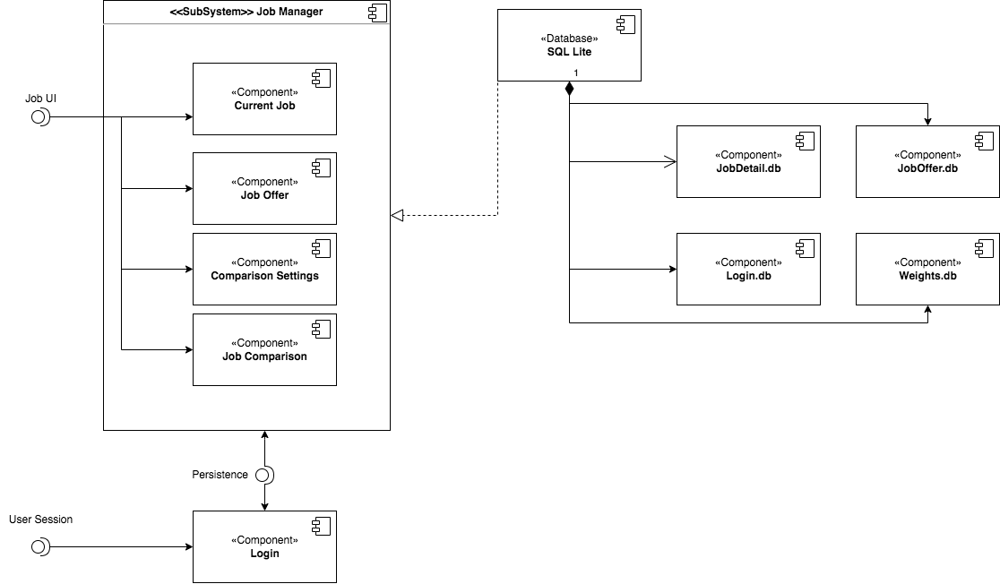
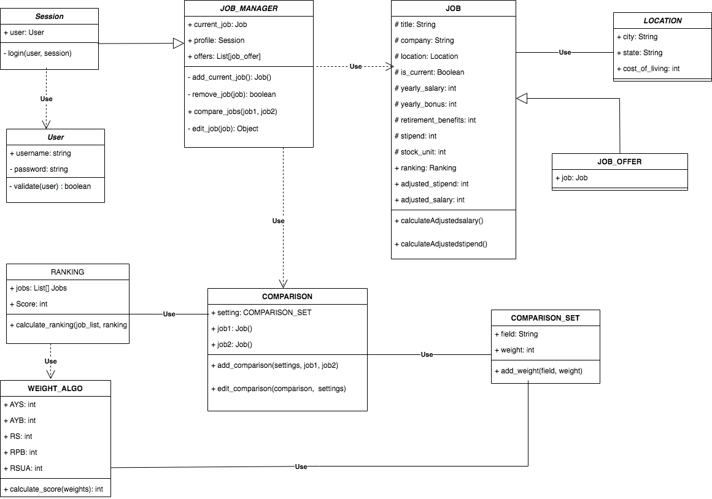
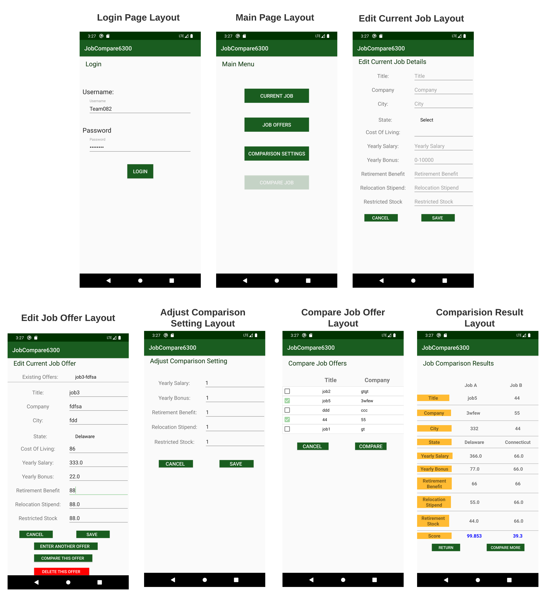

# Design Document

**Author**: Team082

## 1 Design Considerations

The subsections below describe assumptions, constraints, and the system environment that Team082 will be working on.

### 1.1 Assumptions

- This app will only be used on the devices with Android platform
- The minimum API level for this app should be API 29: Android 10.0 (Q)
- Users will have internet to download and install the app 
- All authorized users will have login access to this app
- Each authorized account will only be used for one person. This application won't support for keeping track of multiple persons for one account. 
- The application requirements and scope of this project won't be changed extremely overtime

### 1.2 Constraints

- This app will be developed and deployed on Android platform with minimum level of API 29 : Android 10.0 (Q)
- The maximum number of current job offer for each user will be 1
- The maximum number of job offers for each user will be 100
- All data will be stored in the local instance of SQLite

### 1.3 System Environment

- Hardware: Any phone or tablet device that run on Android platform
- Software: Target SDK version is 29; SQLite database to implement Java Persistance API

## 2 Architectural Design

The subsecions below will describe the top-level components of the system and the interactions between elements

### 2.1 Component Diagram

The above componnet diagram, a structural UML diagram, shows how different component interact with each other at high level. Briefly, Job Manager provide the interface for users to utilize the components of Job Offer, Comparision Setting, and Job Comparision. Comparision Setting pass the job ranking information to Job Comparision after calculation. SQLite ensures the data persistence for the whole system.   

### 2.2 Deployment Diagram

This app is simple and there is no connection with other server. Whole app will be deployed on one hardware device with in situ database built in its operating system. Therefore, it is unnessary to have deploymnet diagram for this project.

## 3 Low-Level Design

The subsecions below describe the low-level design for each components in the system.

### 3.1 Class Diagram

The above class diagram, a structural UML diagram, shows detailed information about classes, operations, attributes of each component, and interactions between components in this system. The discussion of class diagram has been discussed in the Deliverable Phase 1.  

### 3.2 Other Diagrams

No other diagrams shows in this system.

## 4 User Interface Design

The above UI Design shows the specific layout of this app.