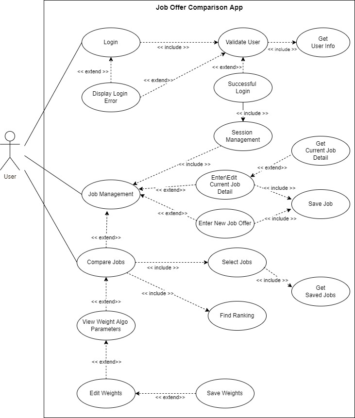

# Use Case Model

## Team082

## 1 Use Case Diagram

## 2 Use Case Descriptions

| Name |   Basic Flow - Login  |    
|:-----|:-----|
| Requirements | Login user into the Job Compare App | 
| Actor(s) | User | 
| Pre-conditions | The job compare app should be running on the phone and in working state. User enters username and password combination to login into this app.  | 
| Post-conditions | User is navigated to the screen where different menu options are available.  | 
| __Main Scenarios__ | __Actions__ | 
|1|  User is on the Login Screen| 
|2|  User enters username and password and clicks on Login button | 
|3|  App validates username and password | 
| __Extension Scenarios__     | __Actions__ | 
|3A|  User enters wrong username and password | 
|3B|  User enters correct username and password | 

------------------------------------------------------------------------------
| Name |  3A Alternate Flow - Login Error |    
|:-----|:-----|
| Requirements | Provides login error message to the user when user enters wrong username and password combination | 
| Actor(s) | User | 
| Pre-conditions | The job compare app should be running on the phone and in working state. User enters username and password combination to login into this app. The app validates username and password combination. | 
| Post-conditions | User is navigated to the Login screen where Login error message is displayed.  | 
| __Main Scenarios__ | __Actions__ | 
|1|  User is shown message that username and password is not correct | 
|2|  On the Login screen, username and password input controls are cleared out | 
|3|  User enters new username and password combinations and clicks on Login button | 
| __Extension Scenarios__   | __Actions__ | 
|3A|  User enters wrong username and password | 
|3B|  User enters correct username and password |

------------------------------------------------------------------------------
| Name |  3B Alternate Flow - Login Successful |    
|:-----|:-----|
| Requirements | On Sucessful login, user is provided an interface where different kinds of menu options are available to navigate to the next screens. | 
| Actor(s) | User | 
| Pre-conditions | The job compare app should be running on the phone and in working state. User enters username and password combination to login into this app. The app validates username and password combination. | 
| Post-conditions | Users session is created and navigated to the main page layout.  | 
| __Main Scenarios__ | __Actions__ | 
|1|  User is navigated to the Job management (Main Page). | 
 
__   __
------------------------------------------------------------------------------

| Name |   Basic Flow - Job management (Main Page)  |    
|:-----|:-----|
| Requirements | User is presented with different options to navigate to the next screens  | 
| Actor(s) | User | 
| Pre-conditions | The job compare app should be running on the phone and in working state. User is successfully logged into the app. | 
| Post-conditions | User is navigated to the next screen based on the menu option selected on the main page.  | 
| __Main Scenarios__ | __Actions__ | 
|1|  User is presented with 4 menu options a) Current Job b) Job Offers c) Comparison Settings d) Compare Jobs | 
|2|  User clicks on one of the options and User is navigated to the next screen | 
| __Extension Scenarios__ | __Actions__ | 
|2A|  User is navigated to Current Job Detail screen | 
|2B|  User is navigated to Job Offer Detail Screen | 
|2C|  User is navigated to Comparison Settings Screen | 
|2D|  User is navigated to Compare Jobs Screen(This option is available only when there are atleast 2 jobs [current job\job offer] ) | 
------------------------------------------------------------------------------

| Name |  2A Alternate Flow - Current Job Detail |    
|:-----|:-----|
| Requirements | User is provided with an interface to enter\edit current job detail. | 
| Actor(s) | User | 
| Pre-conditions | The job compare app should be running on the phone and in working state. User selected an option - Current Job Detail on the Job management (Main Page) | 
| Post-conditions | Users is provided with a screen to enter\edit current job detail.  | 
| __Main Scenarios__ | __Actions__ | 
|1|  User is navigated to the Current Job Detail. | 
|2|  If Current Job Detail information exists, this screen is populated with that job information. | 
|3|  If the current job detail doesnt exists, all the input controls on this screen is in default cleared state  | 
|4|  User enters current job details and clicks on 'Save' button. | 
|5|  Current job details is validated, if validation fails an error message is displayed on the screen. |
|6|  User corrects current job details and clicks on 'Save' button again. | 
|7|  If current job details validation succeeds, current job detail is saved in persistent store. |
|8|  User clicks on 'Cancel' button. |
| __Extension Scenarios__ | __Actions__ | 
|8A|  User is navigated to Job management (Main Page) screen | 
 ------------------------------------------------------------------------------

| Name |  2B Alternate Flow - Job Offer |    
|:-----|:-----|
| Requirements | User is provided with an interface to enter new job offer. | 
| Actor(s) | User selected an option - Job Offers on the Job management (Main Page) | 
| Pre-conditions | The job compare app should be running on the phone and in working state.  | 
| Post-conditions | Users is provided with a screen to enter new job offer.  | 
| __Main Scenarios__ | __Actions__ | 
|1|  User is navigated to the Job offer screen to enter new Job Offer.                          | 
|2|  All the input controls on this screen is in default cleared state  | 
|3|  User enters new job offer and clicks on 'Save' button. | 
|4|  New job offer inputs are validated, if validation fails an error message is displayed on the screen. |
|5|  User corrects new job offer information and clicks on 'Save' button again. | 
|6|  If new job offer validation succeeds, new job offer information is saved in persistent store. |
|7|  User clicks on 'Cancel' button. |
| __Extension Scenarios__ | __Actions__ | 
|7A|  User is navigated to Job management (Main Page) screen | 
------------------------------------------------------------------------------

| Name |  2C Alternate Flow - Comparison Settings  |    
|:-----|:-----|
| Requirements | User is provided with an interface to enter new job offer. | 
| Actor(s) | User | 
| Pre-conditions | The job compare app should be running on the phone and in working state. User selected an option - Comparison Settings on the Job management (Main Page) | 
| Post-conditions | Users is provided with a screen to edit Comparison Settings.| 
| __Main Scenarios__ | __Actions__ | 
|1|  User is navigated to the Comparison Settings screen. | 
|2|  All the weights for the comparison parameter is in default value of 1.  | 
|3|  User updates values for the comparison parameter(s)  | 
|4|  User clicks om 'Save' and these parameters are saved in persistent store. | 
|5|  User clicks on 'Cancel' button. |
| __Extension Scenarios__ | __Actions__ | 
|5A|  User is navigated to Job management (Main Page) screen | 
------------------------------------------------------------------------------

| Name |  2D Alternate Flow - Compare Jobs |    
|:-----|:-----|
| Requirements | User is provided with an interface to compare job offers. | 
| Actor(s) | User | 
| Pre-conditions | The job compare app should be running on the phone and in working state. User selected an option - Compare Jobs on the Job management (Main Page) | 
| Post-conditions | Users is provided with a screen to perform Job Offer comparison.| 
| __Main Scenarios__ | __Actions__ | 
|1|  User is navigated to the Compare Job Screen. | 
|2|  The compare Job Screen list all jobs(current job detail and job offers) |
|3|  User selects 2 jobs to compare on this screen  |
|4|  Selected jobs are compared and the comparison results are displayed.  | 
|5|  User can repeat step 3 and 4 for other jobs  |
|6|  User clicks on 'Return' button. |
| __Extension Scenarios__ | __Actions__ | 
|6A|  User is navigated to Job management (Main Page) screen | 
------------------------------------------------------------------------------
