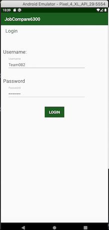
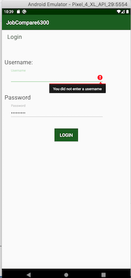
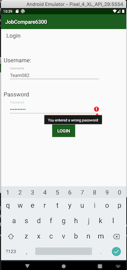
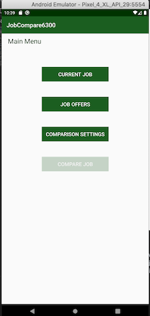
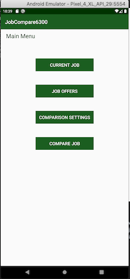

# User Manual

## Scope

This document covers the basic information required to run and utilize the Job Comparison application.

## Getting started

### Setting up an environment

- The application needs an authenticated user to use the features of the application. 
- If you are using an emulator, make sure you have Java Version 8 installed on your computer. 
- The application is currently not published for download on your phone. To run the application, download the package from the github repository and open it in your 
IDE/emulator of choice, our recommendation is AndroidStudio. You will then be able to run the application on the emulator.

### Logging In
 &nbsp;&nbsp;&nbsp;  &nbsp;&nbsp;&nbsp; 

  

- The application needs an authenticated user to use the features of the application. 
- The username and password is pre-populated for the single user scenario.
- Username and password is validated with the default ones and if it doesnt match an error message is displayed. 

| Field Name  | Field Length | Supported DataType | Field Values |
|--- | --- | --- | --- |
|UserName | 15 | Alphanumeric and Special characters | Team082 
|Passsword | 15 | Alphanumeric and Special characters | Spring22# 

Enter your username and password when
prompted and then select 'Login'. 

![#c5f015] ### Job Manager Home Page

An authenticated user will then be taken to the home page of the application where they have the option to navigate to
4 features.

 &nbsp;&nbsp;&nbsp;&nbsp;&nbsp;   &nbsp;&nbsp;&nbsp; 

- If more than 2 jobs exists in the system [(Current Job detail + 1 Job Offer) OR (2 Job Offers) ], Compare Job option is enabled or its disabled.

#### Current Job

The user may select the 'Current Job' option where they will be taken to a job form. They can then either enter their current job if they have not done so already, or edit their current job.

<<TO DO: Expand on what the fields are>>

#### Job Offers

The user may select the 'Job Offers' option where they will be taken to their job offers. The initial page will
provide a list of all their job offer titles, if any are available. They can then select an offer from the list and edit it.
They can also create a brand new job offer by selecting the 'Add Offer' button. The user will then be taken to the job offer form where they can save a new offer, which will then be added to the job offer list on the previous page.

#### Comparion Settings

The user may select the 'Comparison Settings' menu option to be taken to a page for the weight settings of yearly salary, yearly bonus, retirement benefit, relocation stipend, and restricted stock, which would be used in the job offer comparison. After enterning values for all parameters, the user can choose to either save the setting by clicking the 'SAVE' button or discard current setting and go back to the main menu by clicking the 'CANCEL' button. If the user does not set up the settings, all weights will be equal to 1 by default. 

#### Compare Job

The user may select the 'Compare Job' option where they will be taken to a list of job offers. The directed page will show the title and company name based on the scores (from highest score to lowest) calculated from 'Comparison Settings'. The user can then choose two jobs by clicking two checkbox. If the user like to re-select two jobs, the user can click 'Cancel' button that all selected checkbox will become unchecked status. If the user like to compare two selected jobs, the user can click 'Compare' button and then be taken to the 'Compare Two Jobs' page, which will show the detialed information of two slected jobs. If the user like to compare another two job offer, the user can click 'Compare More' button where they will be taken back to the 'Compare Job' page. If the user like to return to the Home Page (Job Manager Page), they can click 'Return' button where   they will be taken back to the 'Job Manage Home Page'.

